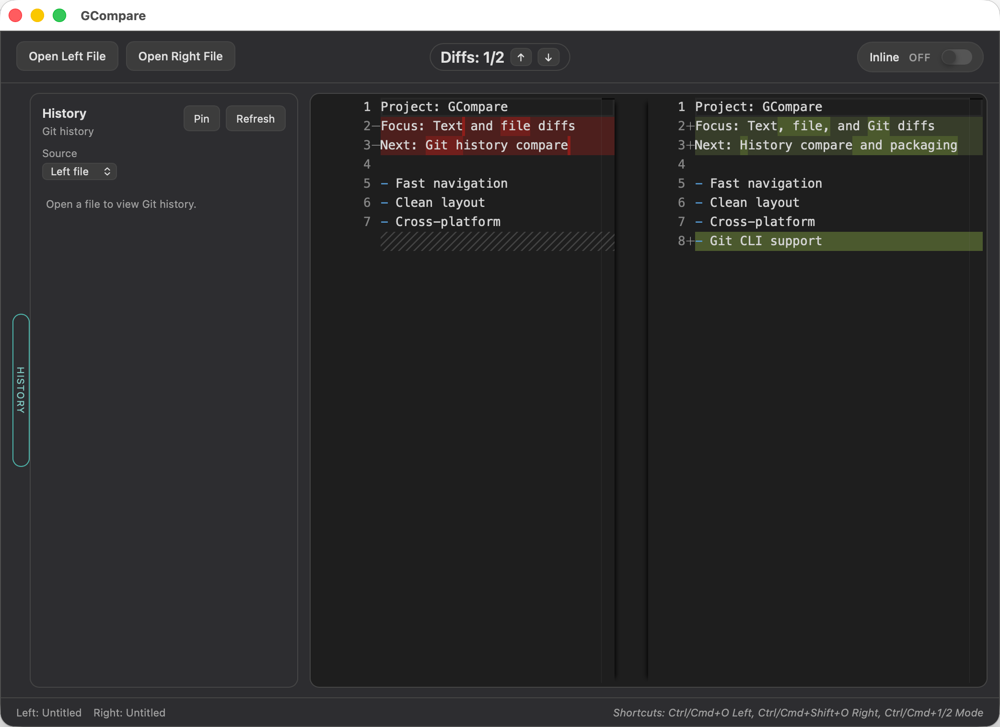

# GCompare

[](https://github.com/GOLDhjy/GCompare/actions/workflows/release.yml)
[](https://github.com/GOLDhjy/GCompare/releases)
[](https://github.com/GOLDhjy/GCompare/stargazers)
[](LICENSE)


[English version](README_EN.md)

GCompare 是一个基于 Tauri v2 的跨平台文本/文件差异对比工具，目标是做一个轻量、可离线、面向开发者的对比工具，尽量保持最后的包体较小。

## 功能
- 文本差异对比（Monaco diffEditor）
- 本地文件对比（选择文件/拖拽文件）
- 系统“打开方式”关联（常见文本/代码扩展名）
- Inline / Side-by-side 切换
- 差异导航（上一个 / 下一个）
- 主题设置（系统 / 亮色 / 深色）
- Git 历史面板：提交列表与单文件对比（基于 git CLI），点击可以固定面板在左侧
- 支持编辑文件以及保存文件
- 检查更新可以自动更新为新版，位于help里面



## 下载
请前往 Release 页面下载：  
https://github.com/GOLDhjy/GCompare/releases

## 使用
- 打开左/右文件：点击按钮或使用快捷键
- 拖拽文件：拖到左/右区域即可
- 系统打开：将文件“用 GCompare 打开”
- 视图切换：点击 Inline 开关
- 差异导航：点击 ↑ / ↓ 按钮
- Git 历史：悬停左侧 History 标签，点击提交进行对比
- 固定历史面板：点击 Pin

## 快捷键
- 左侧打开：Ctrl/Cmd + O
- 右侧打开：Ctrl/Cmd + Shift + O
- 视图切换：Ctrl/Cmd + 1 / 2

## 环境

- 安装Tauri
    - 安装Rust

        Mac：
        ```
        curl --proto '=https' --tlsv1.2 https://sh.rustup.rs -sSf | sh
        ```
        Win：
        ```
        winget install --id Rustlang.Rustup
        ```
        或者前往 https://www.rust-lang.org/zh-CN/tools/install 下载 rustup。

        Win还要额外安装Cpp桌面开发：https://v2.tauri.app/zh-cn/start/prerequisites/#webview2
        
- 安装NodeJS

    在安装完上面的东西之后还是有可能会报找不到Tauri，执行一下`npm install`，安装一下依赖。
    `npm run tauri dev`

- 用Tauri创建项目

Bash：`sh <(curl https://create.tauri.app/sh)`
PowerShell：`irm https://create.tauri.app/ps | iex`
## 开发
环境要求：Node.js、Rust、Tauri 依赖

```bash
npm install
npm run tauri dev
```

## 路线图

### 已完成 ✅
- 文本差异对比（Monaco diffEditor）
- 本地文件对比（选择文件/拖拽文件）
- 系统"打开方式"关联（常见文本/代码扩展名）
- Inline / Side-by-side 切换
- 差异导航：上一个/下一个差异
- 暗色/深色主题切换
- Git 集成：单文件历史对比（基于 git CLI）

### 计划中 🚧
- 快捷键

## 许可证
MIT License
