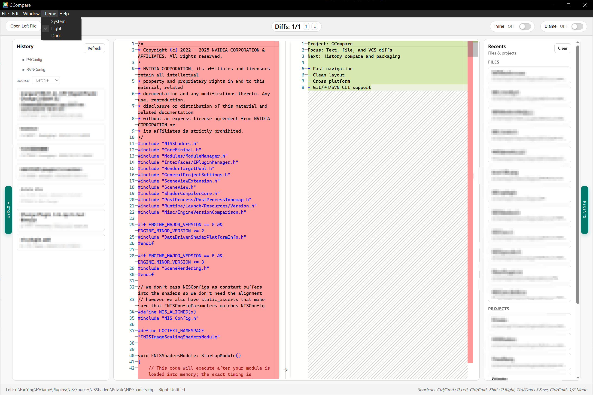
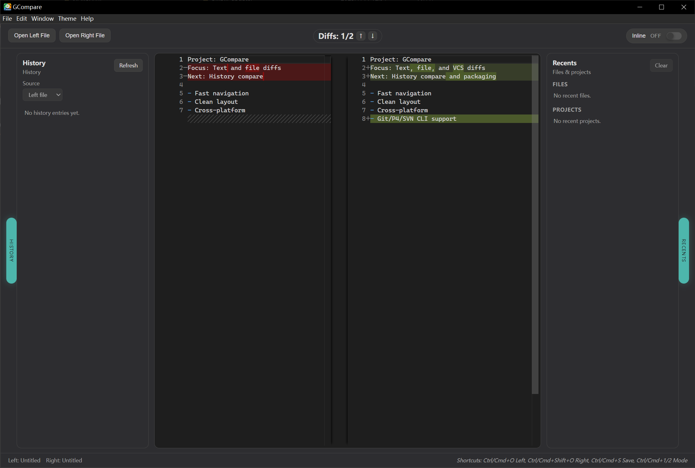
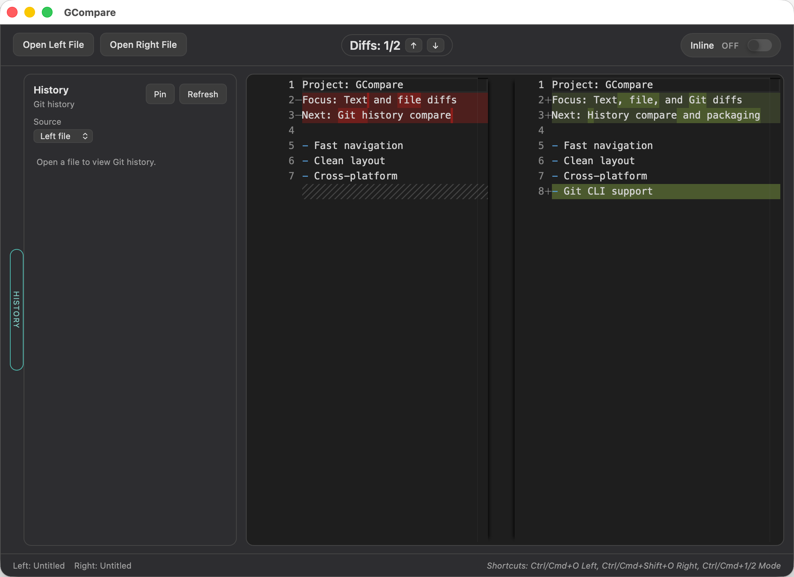

# GCompare

[](https://github.com/GOLDhjy/GCompare/actions/workflows/release.yml)
[](https://github.com/GOLDhjy/GCompare/releases)
[](https://github.com/GOLDhjy/GCompare/releases)
[](https://github.com/GOLDhjy/GCompare/stargazers)
[](LICENSE)


[English version](README_EN.md)

[官网Page](https://goldhjy.github.io/GCompare/)

GCompare 是一个基于 Tauri v2 的跨平台文本/文件差异对比工具，目标是做一个轻量、可离线、面向开发者的对比工具，尽量保持最后的包体较小。

## 功能
- 文本差异对比（Monaco diffEditor）
- 本地文件对比（选择文件/拖拽文件）
- 系统“打开方式”关联（常见文本/代码扩展名）
- Inline / Side-by-side 切换
- 差异导航（上一个 / 下一个）
- Blame 模式（Git/P4/SVN 行级归因）
- 主题设置（系统 / 亮色 / 深色）
- Git/P4/SVN 历史面板：提交/变更列表与单文件对比（基于 git/p4/svn CLI），点击可以固定面板在左侧
- P4 连接设置：当没有 p4config 文件时，可在 History 面板配置 P4PORT/P4USER/P4CLIENT 作为备用连接
- 支持编辑文件以及保存文件
- 检查更新可以自动更新为新版，位于 help 里面

<p align="center">
  
</p>
<p align="center"><sub>v0.4.0</sub></p>

<p align="center">
  
</p>
<p align="center"><sub>v0.3.0</sub></p>

<p align="center">
  
</p>
<p align="center"><sub>v0.2.0</sub></p>

## 下载
请前往 Release 页面下载：  
https://github.com/GOLDhjy/GCompare/releases

## 使用
- 打开左/右文件：点击按钮或使用快捷键
- 拖拽文件：拖到左/右区域即可
- 系统打开：将文件“用 GCompare 打开”
- 视图切换：点击 Inline 开关
- 差异导航：点击 ↑ / ↓ 按钮
- Blame 模式：点击 Blame 开关查看行级归因
- Git/P4/SVN 历史：悬停左侧 History 标签，点击提交/变更进行对比（优先 Git）
- P4 设置：点击 History 面板标题旁的 P4 按钮，可配置备用 P4 连接（当项目无 p4config 文件时使用）
- 固定历史面板：点击面板按钮可以 Pin
- 最近打开文件，在右侧可以打开并且固定

### P4V 集成
可以将 GCompare 设置为 P4V 的外部 Diff 工具：

1. 打开 P4V → Edit → Preferences → Diff
2. 选择 "Use external application for diffing"
3. 设置路径为 GCompare 的安装路径，例如：`xxx\gcompare.exe`
4. 参数设置为：`%1 %2`

设置完成后，在 P4V 中对比文件时会自动调用 GCompare。

## 快捷键
- 左侧打开：Ctrl/Cmd + O
- 右侧打开：Ctrl/Cmd + Shift + O
- 视图切换：Ctrl/Cmd + 1 / 2

## 环境

- 安装Tauri
    - 安装Rust

        Mac：
        ```
        curl --proto '=https' --tlsv1.2 https://sh.rustup.rs -sSf | sh
        ```
        Win：
        ```
        winget install --id Rustlang.Rustup
        ```
        或者前往 https://www.rust-lang.org/zh-CN/tools/install 下载 rustup。

        Win还要额外安装Cpp桌面开发：https://v2.tauri.app/zh-cn/start/prerequisites/#webview2
        
- 安装NodeJS

    在安装完上面的东西之后还是有可能会报找不到Tauri，执行一下`npm install`，安装一下依赖。
    `npm run tauri dev`

- 用Tauri创建项目

Bash：`sh <(curl https://create.tauri.app/sh)`
PowerShell：`irm https://create.tauri.app/ps | iex`
## 开发
环境要求：Node.js、Rust、Tauri 依赖

```bash
npm install
npm run tauri dev
```

## 路线图

### 已完成 ✅
- 文本差异对比（Monaco diffEditor）
- 本地文件对比（选择文件/拖拽文件）
- 系统"打开方式"关联（常见文本/代码扩展名）
- Inline / Side-by-side 切换
- 差异导航：上一个/下一个差异
- Blame 模式：行级归因（基于 git/p4/svn CLI）
- 暗色/深色主题切换
- Git/P4/SVN 集成：单文件历史对比（基于 git/p4/svn CLI，优先 Git）

### 计划中 🚧
- 快捷键完善
- 字体大小设置

## 许可证
MIT License
