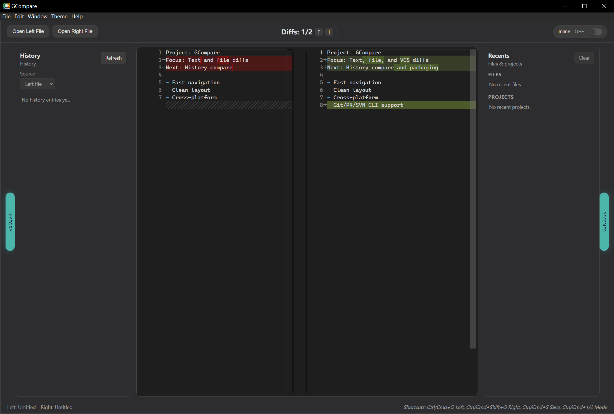

# GCompare

[](https://github.com/GOLDhjy/GCompare/actions/workflows/release.yml)
[](https://github.com/GOLDhjy/GCompare/releases)
[](https://github.com/GOLDhjy/GCompare/releases)
[](https://github.com/GOLDhjy/GCompare/stargazers)
[](LICENSE)

[中文版](README.md)

[Official Page](https://goldhjy.github.io/GCompare/)

GCompare is a cross-platform text/file diff tool built on Tauri v2. The goal is a lightweight, offline-friendly, developer-focused diff tool with a small final bundle.

## Features
- Text diffing (Monaco diffEditor)
- Local file compare (select files / drag-and-drop)
- System "Open with" associations (common text/code extensions)
- Inline / Side-by-side switch
- Diff navigation (previous / next)
- Blame mode (line-level attribution for Git/P4/SVN)
- Theme settings (system / light / dark)
- Git/P4/SVN history panel: commit/changelist list and single-file compare (via git/p4/svn CLI), click to pin the panel on the left
- P4 connection settings: configure P4PORT/P4USER/P4CLIENT as fallback when no p4config file exists
- Edit and save files
- Check for updates can auto-update to new versions, under Help

<p align="center">
  
</p>
<p align="center"><sub>v0.3.0</sub></p>
<p align="center">
  
</p>
<p align="center"><sub>v0.2.0</sub></p>

## Download
Please go to Releases:  
https://github.com/GOLDhjy/GCompare/releases

## Usage
- Open left/right file: click buttons or use shortcuts
- Drag files: drop on the left/right area
- Open with: open files with GCompare
- Switch view: click the Inline toggle
- Diff navigation: use the ↑ / ↓ buttons
- Blame mode: click the Blame toggle to view line-level attribution
- Git/P4/SVN history: hover the History tab, click a commit/changelist to compare (Git first)
- P4 settings: click the P4 button next to the History panel title to configure a fallback P4 connection (used when there is no p4config file)
- Pin history panel: click the panel button to pin
- Recent files can be opened and pinned on the right

## P4V Integration
You can set GCompare as the external Diff tool in P4V:

1. Open P4V -> Edit -> Preferences -> Diff
2. Select "Use external application for diffing"
3. Set the path to the GCompare installation, e.g.: `xxx\gcompare.exe`
4. Set arguments to: `%1 %2`

After setup, P4V will automatically call GCompare when comparing files.

## Shortcuts
- Open left: Ctrl/Cmd + O
- Open right: Ctrl/Cmd + Shift + O
- Toggle view: Ctrl/Cmd + 1 / 2

## Environment

- Install Tauri
    - Install Rust

        Mac:
        ```
        curl --proto '=https' --tlsv1.2 https://sh.rustup.rs -sSf | sh
        ```
        Win:
        ```
        winget install --id Rustlang.Rustup
        ```
        Or download rustup at https://www.rust-lang.org/tools/install

        On Windows, also install C++ Desktop Development: https://v2.tauri.app/start/prerequisites/#webview2

- Install NodeJS

    After installing the above, you may still see "Tauri not found". Run `npm install` to install dependencies.
    `npm run tauri dev`

- Create a project with Tauri

Bash: `sh <(curl https://create.tauri.app/sh)`
PowerShell: `irm https://create.tauri.app/ps | iex`

## Development
Requirements: Node.js, Rust, Tauri dependencies

```bash
npm install
npm run tauri dev
```

## Roadmap

### Done ?
- Text diffing (Monaco diffEditor)
- Local file compare (select files / drag-and-drop)
- System "Open with" associations (common text/code extensions)
- Inline / Side-by-side switch
- Diff navigation: previous/next change
- Blame mode: line-level attribution (via git/p4/svn CLI)
- Dark/Light theme toggle
- Git/P4/SVN integration: single-file history compare (via git/p4/svn CLI, Git first)

### Planned ??
- Shortcuts
- Font size settings
- Left/right scroll control

## License
MIT License
