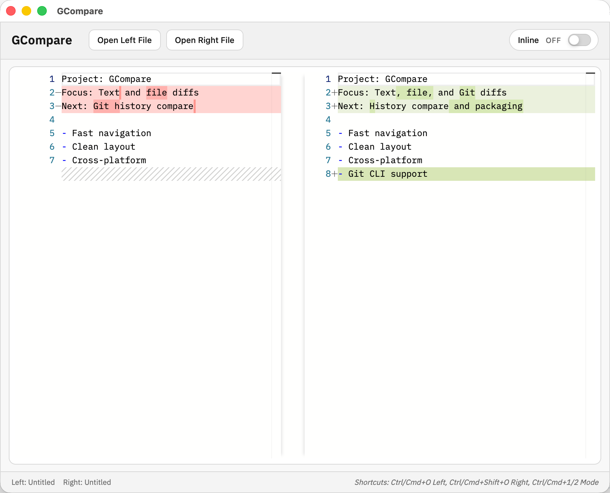

# GCompare

[](https://github.com/GOLDhjy/GCompare/actions/workflows/release.yml)
[](https://github.com/GOLDhjy/GCompare/releases)
[](https://github.com/GOLDhjy/GCompare/stargazers)
[](LICENSE)



English README. 中文版: [README.md](README.md)

GCompare is a cross-platform text/file diff tool built with Tauri v2. It focuses on a lightweight, offline-first workflow for developers.

## Features
- Text diffing (Monaco diffEditor)
- Local file compare (open or drag-and-drop)
- System “Open with” associations for common text/code types
- Inline / Side-by-side switch
- Planned: Git single-file history compare (via git CLI)

## Download
See Releases:  
https://github.com/GOLDhjy/GCompare/releases

## Usage
- Open left/right file: buttons or shortcuts
- Drag files: drop on left/right side
- Open with: use “Open with GCompare”
- Switch view: use the Inline toggle

## Shortcuts
- Open left: Ctrl/Cmd + O
- Open right: Ctrl/Cmd + Shift + O
- Toggle view: Ctrl/Cmd + 1 / 2

## Development
Requirements: Node.js, Rust, Tauri dependencies

```bash
npm install
npm run tauri dev
```

## Roadmap

### Done ✅
- Text diffing (Monaco diffEditor)
- Local file compare (open or drag-and-drop)
- System "Open with" associations for common text/code types
- Inline / Side-by-side switch

### Planned 🚧
- Diff navigation: Previous/Next change buttons
- Dark/Light theme toggle
- Search: Find and highlight in diffs
- Git integration: Single-file history compare (via git CLI)
- Paste text compare

## License
MIT License
